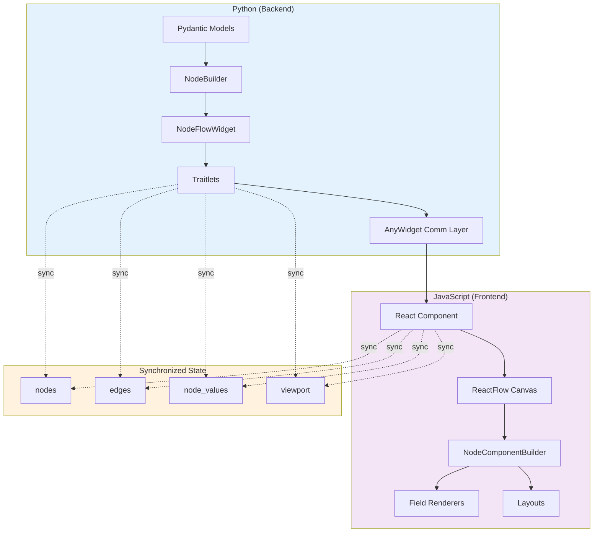
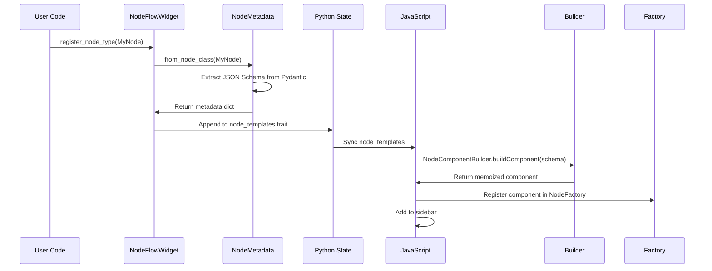
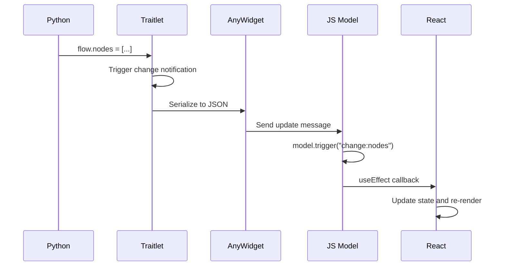
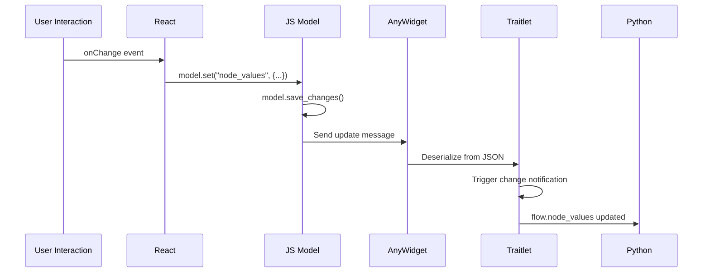

# Python-JavaScript Architecture

This guide explains how PyNodeWidget bridges Python and JavaScript using AnyWidget, and how the two sides communicate.

## Overview

PyNodeWidget is a hybrid application with two main components:



## Communication Layer: AnyWidget

[AnyWidget](https://anywidget.dev) provides the communication bridge between Python and JavaScript using the Jupyter widget protocol.

### How It Works

1. **Python defines traits** that should sync to JavaScript
2. **AnyWidget manages serialization** and message passing
3. **JavaScript receives updates** and re-renders the UI
4. **User interactions** trigger messages back to Python

### Trait Synchronization

In `widget.py`:

```python
class NodeFlowWidget(anywidget.AnyWidget):
    # Traits marked with .tag(sync=True) automatically sync
    nodes = t.List(trait=t.Dict()).tag(sync=True)
    edges = t.List(trait=t.Dict()).tag(sync=True)
    node_values = ObservableDictTrait().tag(sync=True)
    viewport = t.Dict(default_value={"x": 0, "y": 0, "zoom": 1}).tag(sync=True)
```

In JavaScript (`index.tsx`):

```typescript
export function render({ model, el }) {
  // Access Python traits via model
  const nodes = model.get("nodes");
  const edges = model.get("edges");
  
  // Listen for changes from Python
  model.on("change:nodes", () => {
    const newNodes = model.get("nodes");
    // Update UI
  });
  
  // Send changes to Python
  model.set("nodes", updatedNodes);
  model.save_changes();
}
```

## Python Side Architecture

### Class Hierarchy

```
anywidget.AnyWidget
    ├── NodeFlowWidget           # Main widget
    └── JsonSchemaNodeWidget     # Base node class
```

### Key Components

#### 1. NodeFlowWidget (`widget.py`)

The main widget managing the entire node graph.

**Responsibilities:**
- Node type registration
- Graph state management (nodes, edges)
- Value synchronization via `ObservableDict`
- Import/export functionality

**Key Methods:**
```python
def register_node_type(self, node_class: Type) -> "NodeFlowWidget":
    """Register a node type from a class implementing NodeFactory protocol."""
    
def update_node_value(self, node_id: str, key: str, value: any) -> None:
    """Update a value and trigger sync to JavaScript."""
    
def get_node_values(self, node_id: str) -> Dict[str, Any]:
    """Get current values for a node."""
```

#### 2. JsonSchemaNodeWidget (`json_schema_node.py`)

Base class for custom nodes, implementing the NodeFactory protocol.

**Responsibilities:**
- Pydantic model to JSON Schema conversion
- Value management and validation
- Handle configuration
- Optional execution logic

**Key Attributes:**
```python
class MyNode(JsonSchemaNodeWidget):
    label: str = "Node Name"          # Required
    parameters: Type[BaseModel]        # Required
    icon: str = "⚙️"                   # Optional
    inputs: List[Dict] = [...]         # Optional
    outputs: List[Dict] = [...]        # Optional
```

#### 3. ObservableDict (`observable_dict.py`)

Auto-syncing dictionary that triggers callbacks on mutations.

**Why It Exists:**
Regular Python dicts don't trigger Traitlets observers when nested values change. `ObservableDict` wraps a dict and fires callbacks on any mutation.

```python
class ObservableDict(MutableMapping):
    def __setitem__(self, key, value):
        self._data[key] = value
        if self._callback:
            self._callback()  # Triggers sync to JavaScript
```

Used for `node_values` to ensure UI updates when nested values change:
```python
flow.node_values["node-1"]["threshold"] = 0.8  # Triggers sync
```

#### 4. NodeFactory Protocol (`protocols.py`)

Defines the interface for node classes:

```python
class NodeFactory(Protocol):
    label: str
    parameters: Type[BaseModel]
    icon: str
    category: str
    description: str
    inputs: List[Dict[str, str]]
    outputs: List[Dict[str, str]]
```

### Node Registration Flow



## JavaScript Side Architecture

### Component Hierarchy

```
ReactFlowProvider
  └── NodeFlowComponent (index.tsx)
        ├── ModelProvider (model context)
        ├── FieldRegistryProvider
        ├── NodeSidebar
        ├── FlowCanvas
        │     └── NodeComponentBuilder (for each node)
        │           ├── NodeForm
        │           │     └── FieldFactory
        │           │           └── Field Components
        │           ├── Layout Component
        │           └── NodeHandles
        └── FlowToolbar
```

### Key Components

#### 1. Entry Point (`index.tsx`)

Main render function called by AnyWidget:

```typescript
export function render({ model, el }: { model: AnyWidgetModel; el: HTMLElement }) {
  const root = createRoot(el);
  
  root.render(
    <ReactFlowProvider>
      <ModelProvider model={model}>
        <FieldRegistryProvider>
          <NodeFlowComponent />
        </FieldRegistryProvider>
      </ModelProvider>
    </ReactFlowProvider>
  );
}
```

#### 2. NodeFlowComponent (`index.tsx`)

Main React component managing the UI.

**State Management:**
- Uses Zustand stores for local state
- Subscribes to model changes for Python sync
- Manages ReactFlow instance

**Key Hooks:**
```typescript
// Subscribe to Python state
useEffect(() => {
  model.on("change:nodes", handleNodesChange);
  model.on("change:edges", handleEdgesChange);
  model.on("change:node_values", handleValuesChange);
}, [model]);

// Send changes to Python
const updateNodeValue = (nodeId: string, key: string, value: any) => {
  const nodeValues = model.get("node_values");
  nodeValues[nodeId] = { ...nodeValues[nodeId], [key]: value };
  model.set("node_values", nodeValues);
  model.save_changes();
};
```

#### 3. JsonSchemaNode (`JsonSchemaNode.tsx`)

Universal node renderer configured from Python.

**Props:**
```typescript
interface JsonSchemaNodeProps {
  id: string;
  data: CustomNodeData;
  selected: boolean;
}

interface CustomNodeData {
  label: string;
  parameters: JsonSchema;
  values: Record<string, FieldValue>;
  inputs?: HandleConfig[];
  outputs?: HandleConfig[];
  layoutType?: string;
  handleType?: HandleType;
  header?: NodeHeaderConfig;
  footer?: NodeFooterConfig;
  style?: NodeStyleConfig;
  fieldConfigs?: Record<string, FieldConfig>;
}
```

**Rendering Flow:**
1. Extract configuration from `data` prop
2. Select layout component based on `layoutType`
3. Render header (if configured)
4. Render form fields via `NodeForm`
5. Render footer (if configured)
6. Render handles via layout

#### 4. NodeForm (`components/NodeForm.tsx`)

Generates form from JSON Schema and field configs.

```typescript
export function NodeForm({ schema, values, onChange, fieldConfigs }: NodeFormProps) {
  const properties = schema.properties || {};
  
  return (
    <div className="space-y-2">
      {Object.entries(properties).map(([key, fieldSchema]) => {
        const fieldConfig = fieldConfigs?.[key];
        
        // Check conditional visibility
        if (shouldHideField(fieldConfig, values)) {
          return null;
        }
        
        return (
          <FieldFactory
            key={key}
            name={key}
            schema={fieldSchema}
            value={values[key]}
            onChange={(value) => onChange(key, value)}
            config={fieldConfig}
          />
        );
      })}
    </div>
  );
}
```

#### 5. FieldFactory (`components/fields/FieldFactory.tsx`)

Routes to appropriate field renderer:

```typescript
export function FieldFactory({ name, schema, value, onChange, config }: FieldFactoryProps) {
  // Check for enum
  if (schema.enum) {
    return <SelectField {...props} />;
  }
  
  // Check registry for custom types
  const customRenderer = fieldRegistry.get(schema.type);
  if (customRenderer) {
    return customRenderer({ value, onChange, schema, config });
  }
  
  // Built-in types
  switch (schema.type) {
    case "string": return <StringField {...props} />;
    case "number": return <NumberField {...props} />;
    case "integer": return <NumberField {...props} />;
    case "boolean": return <BooleanField {...props} />;
    default: return <StringField {...props} />;
  }
}
```

#### 6. Registry System

Three registries provide extensibility:

**FieldRegistry** (`components/fields/FieldRegistry.ts`):
```typescript
class FieldRegistry {
  private renderers = new Map<string, FieldRenderer>();
  
  register(type: string, renderer: FieldRenderer): void {
    this.renderers.set(type, renderer);
  }
  
  get(type: string): FieldRenderer | undefined {
    return this.renderers.get(type);
  }
}

export const fieldRegistry = new FieldRegistry();
```

**LayoutFactory** (`components/layouts/LayoutFactory.tsx`):
```typescript
class LayoutFactory {
  private layouts = new Map<string, React.ComponentType<LayoutProps>>();
  
  constructor() {
    this.layouts.set("horizontal", HorizontalLayout);
    this.layouts.set("vertical", VerticalLayout);
    this.layouts.set("compact", CompactLayout);
  }
  
  getLayout(type: string): React.ComponentType<LayoutProps> {
    return this.layouts.get(type) || HorizontalLayout;
  }
}
```

**HandleFactory** (`components/handles/HandleFactory.tsx`):
Similar pattern for handle types.

### State Flow

#### Python → JavaScript (Read)



#### JavaScript → Python (Write)



## Build Process

### JavaScript Build (`js/`)

```bash
# Development build with watch
bun run dev

# Production build
bun run build
```

**Build Tools:**
- **Bun**: Runtime and bundler
- **Vite**: Build tool and dev server
- **TypeScript**: Type checking

**Output:**
- `js/dist/index.js` - Main widget bundle
- `js/dist/index.css` - Styles
- `js/dist/json_schema_node_entry.js` - Standalone node widget
- `js/dist/json_schema_node_entry.css` - Node widget styles

### Python Package Build

```bash
uv build
```

**Build Hook** (`hatch_build.py`):

```python
class CustomBuildHook:
    def initialize(self, version, build_data):
        # Build JavaScript if needed
        if not js_assets_exist():
            subprocess.run(["bun", "run", "build"], cwd="js")
        
        # Copy to static/
        shutil.copy("js/dist/index.js", "src/pynodewidget/static/")
        shutil.copy("js/dist/index.css", "src/pynodewidget/static/")
```

## Value Synchronization Details

### The node_values Challenge

Challenge: Python dicts don't trigger observers on nested mutations.

```python
# This doesn't trigger sync:
flow.node_values["node-1"]["threshold"] = 0.8
```

Solution: `ObservableDict`

```python
class ObservableDict(MutableMapping):
    """Dict that triggers callback on any mutation."""
    
    def __setitem__(self, key, value):
        self._data[key] = value
        self._callback()  # Triggers Traitlet notification
```

### ObservableDictTrait

Custom Traitlet that wraps values in `ObservableDict`:

```python
class ObservableDictTrait(t.Dict):
    def validate(self, obj, value):
        if not isinstance(value, ObservableDict):
            # Wrap in ObservableDict with callback
            obs_dict = ObservableDict(value, callback=lambda: self._notify_trait(obj))
            return obs_dict
        return value
```

### Efficient Updates

To minimize sync overhead:

1. **Batch updates** when possible:
```python
flow.set_node_values("node-1", {
    "threshold": 0.8,
    "mode": "advanced",
    "enabled": True
})
```

2. **Use update_node_value** for single changes:
```python
flow.update_node_value("node-1", "threshold", 0.8)
```

## Performance Considerations

### Python Side

- **Trait serialization** can be expensive for large graphs
- **ObservableDict** adds overhead for every mutation
- **Import/export** is fast (direct JSON)

### JavaScript Side

- **ReactFlow** handles virtualization automatically
- **Zustand** provides efficient state updates
- **React.memo** used for expensive components

### Optimization Tips

1. **Minimize sync frequency**: Batch updates when possible
2. **Use get_flow_data()** for bulk reads (doesn't trigger sync)
3. **Disable auto-layout** for very large graphs
4. **Limit number of visible nodes** (<100 for best performance)

## Debugging

### Python Side

```python
# Enable logging
import logging
logging.basicConfig(level=logging.DEBUG)

# Inspect widget state
print(flow.nodes)
print(flow.edges)
print(dict(flow.node_values))
```

### JavaScript Side

```typescript
// Enable debug mode in browser console
localStorage.setItem("debug", "pynodeflow:*");

// Inspect model
console.log(model.get("nodes"));
console.log(model.get("node_values"));
```

### Common Issues

**Changes not syncing:**
- Check if trait is marked `.tag(sync=True)`
- Ensure `model.save_changes()` is called in JavaScript
- Verify `ObservableDict` is being used for nested values

**UI not updating:**
- Check React component subscriptions to model
- Verify state updates trigger re-renders
- Look for stale closures in useEffect

## Next Steps

- **[JavaScript Development](javascript.md)**: Contributing to the JavaScript codebase
- **[Building from Source](building.md)**: Build process details
- **[Testing](testing.md)**: Testing both Python and JavaScript
