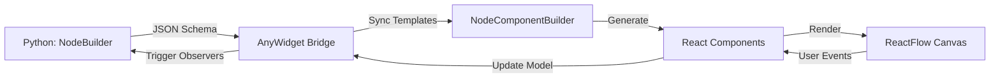

# Developer Guide

!!! info "Audience"
    This guide is for **contributors** and **advanced users** who want to:
    
    - Understand PyNodeWidget's JavaScript/TypeScript internals
    - Contribute to the frontend codebase
    - Create custom field types with React components
    - Build plugins that extend PyNodeWidget's capabilities
    - Debug complex Python ↔ JavaScript interactions

!!! note "Prerequisites"
    Familiarity with:
    
    - **React 18+** - Component model, hooks, state management
    - **TypeScript** - Type system, interfaces, generics
    - **ReactFlow** - Node graph library fundamentals
    - **Modern JavaScript** - ES modules, async/await, bundlers

---

## Overview

PyNodeWidget is a hybrid Python-JavaScript library that renders interactive node graphs in Jupyter notebooks and web applications. The Python side (`pynodeflow` package) provides a declarative API for defining nodes, while the JavaScript side (`js/` folder) renders them using React and ReactFlow.

### Architecture at a Glance



**Key Components:**

- **Python Layer**: `NodeBuilder`, `ObservableDict`
- **AnyWidget Bridge**: Bidirectional state synchronization
- **React Layer**: `NodeComponentBuilder`, `NodePanel`, field components
- **ReactFlow**: Canvas rendering, drag-and-drop, connections

---

## What's in This Guide

This Developer Guide covers the JavaScript/TypeScript side of PyNodeWidget. Use it to:

### [Architecture Overview](architecture.md)
Understand how Python and JavaScript communicate, the state synchronization model, and the data flow between layers.

### [JavaScript Development](javascript.md)
Set up your development environment with Bun, run the dev server, understand the build process, and learn the project structure.

### Field Registry API *(Coming Soon)*
Register custom field types with React components. Examples: color pickers, date ranges, code editors.

### Layout System API *(Coming Soon)*
Create custom node layouts beyond the default vertical form. Control field positioning, grouping, and responsive behavior.

### Handle System API *(Coming Soon)*
Build custom handle components for specialized input/output types. Control visual styling, positioning, and connection logic.

### Hooks API *(Coming Soon)*
Leverage PyNodeWidget's React hooks: `useAutoLayout`, `useContextMenu`, `useExport`, and more.

### Component Library *(Coming Soon)*
Explore the built-in components: `BaseHandle`, `NodeFactory`, `NodeForm`, `LabeledHandle`, and UI primitives.

### State Management *(Coming Soon)*
Understand PyNodeWidget's Zustand stores: node state, selection state, layout state, and data synchronization patterns.

### TypeScript Types *(Coming Soon)*
Complete reference of TypeScript interfaces, types, and generics used throughout the codebase.

---

## When to Use This Guide

| If you want to... | Start here... |
|-------------------|---------------|
| **Understand the architecture** | [Architecture Overview](architecture.md) |
| **Set up a development environment** | [JavaScript Development](javascript.md) |
| **Create a custom field type** | Field Registry API *(coming soon)* |
| **Build a custom node layout** | Layout System API *(coming soon)* |
| **Extend PyNodeWidget with plugins** | Architecture + Field Registry + Hooks |
| **Debug Python ↔ JS sync issues** | [Architecture Overview](architecture.md) |
| **Contribute to the frontend** | [JavaScript Development](javascript.md) + Testing Guide |

---

## Developer vs. User Documentation

!!! tip "Choose the Right Guide"
    - **New to PyNodeWidget?** Start with the [User Guide](../guides/index.md) (Python-only)
    - **Building custom nodes in Python?** See [Creating Custom Nodes](../guides/custom-nodes.md)
    - **Need to extend the JavaScript side?** You're in the right place!

The **User Guide** is pure Python—no JavaScript knowledge required. The **Developer Guide** dives into React, TypeScript, bundlers, and the internal APIs.

---

## Quick Reference

### Key Technologies

- **React 18**: Frontend framework
- **ReactFlow 12**: Node graph visualization
- **TypeScript 5**: Type-safe JavaScript
- **Zustand 4**: Lightweight state management
- **Bun 1.1+**: Fast JavaScript runtime and bundler
- **Vite 5**: Development server and build tool
- **AnyWidget 0.9+**: Jupyter widget bridge

### Project Structure

```
js/
├── src/                  # Main source code
    │   ├── NodeComponentBuilder.tsx # Node component generator
│   ├── NodePanel.tsx            # Node editor panel
│   ├── components/              # React components
│   │   ├── fields/              # Field type components
│   │   ├── handles/             # Handle components
│   │   └── layouts/             # Layout components
│   ├── hooks/                   # React hooks
│   ├── stores/                  # Zustand state stores
│   ├── services/                # Business logic
│   ├── types/                   # TypeScript types
│   └── utils/                   # Helper functions
├── dev/                  # Development app
├── tests/                # Vitest unit tests
└── package.json          # Dependencies and scripts
```

### Build Targets

PyNodeWidget builds three separate JavaScript bundles:

1. **AnyWidget Bundle** (`static/json_schema_node_widget.js`) - For Jupyter notebooks
2. **Standalone Node Editor** (`static/json_schema_node.js`) - For web apps
3. **Development Server** (`dev/app.html`) - For local testing

---

## Contributing

Found a bug or want to add a feature? See the [Contributing Guide](../contributing/development.md) for:

- Setting up the development environment
- Running tests (pytest for Python, vitest for JavaScript)
- Code style guidelines (ruff for Python, prettier/eslint for JavaScript)
- Pull request process

---

## Next Steps

1. **Read the [Architecture Overview](architecture.md)** to understand the system design
2. **Set up your dev environment** with the [JavaScript Development guide](javascript.md)
3. **Explore the codebase** in `js/src/` with the TypeScript types reference
4. **Run the dev server** (`bun run dev`) to see live updates

!!! warning "Work in Progress"
    The API reference sections (Field Registry, Layout System, etc.) are being written. Check back soon or contribute to the documentation!
