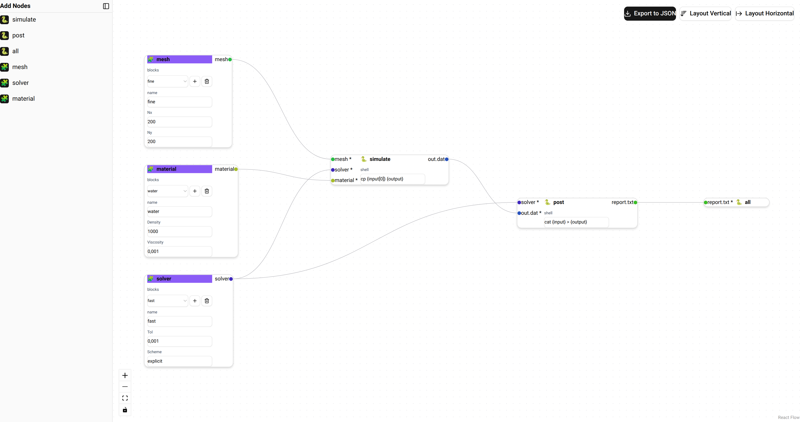
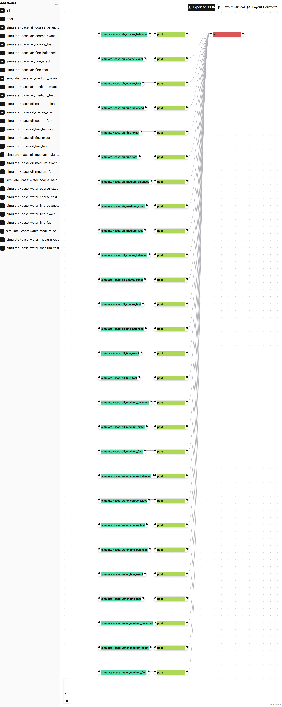

# snakeflow — build a Snakemake parameter sweep in the node editor

This example builds a parameter-sweep workflow from predefined, pydantic-backed
rules and exports it as a runnable Snakemake directory.



The palette (left sidebar) comes from a `RuleRegistry`: one node type per rule
(`simulate`, `post`, `all`) and one *parameter source* type per dimension
(`mesh`, `solver`, `material`). Each source node is a live view into its
dimension's `params.yaml` section: a dropdown switches between the named
blocks (with add / rename / delete in the node), and the fields of the
selected block are rendered from the pydantic models in
[`models.py`](models.py). `autowire()` connects the typed config ports
(source → rule) and the file-pattern ports
(`results/{case}/out.dat` → `post`, …).

`export_sweep()` turns the canvas into:

- [`sweep.csv`](sweep.csv) — the combination table
  (3 meshes × 3 solvers × 3 materials = 27 cases)
- [`params.yaml`](params.yaml) — the named parameter blocks
- [`Snakefile`](Snakefile) — imports `YamlParamSpace`, validates the blocks
  against the pydantic models, and materializes `configs/{case}/{rule}.json`
- `configs/` — the per-case, per-rule JSON configs (real rule inputs, so
  editing one block re-runs exactly the affected cases)

Snakemake expands the 27 cases into this job DAG
(`snakemake --dag` imported back via `parse_dot`/`dot_to_flow`):



## Run it

```bash
# regenerate everything (canvas/dag PNGs need playwright + chromium)
python examples/snakeflow/generate.py

# run the exported workflow
cd examples/snakeflow
PYTHONPATH=. snakemake -c1

# edit a block in params.yaml, then: only the affected cases re-run
PYTHONPATH=. snakemake -n
```

An existing `params.yaml` can also be loaded back onto the canvas with
`sources_from_params_yaml(widget, registry, "params.yaml")`, so the source
nodes round-trip the file.
